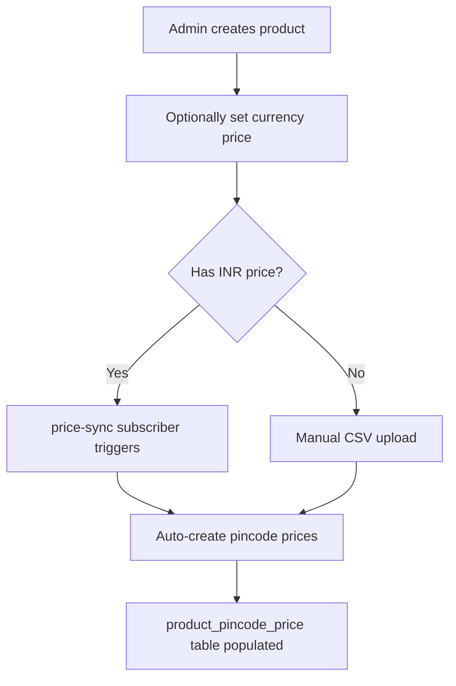
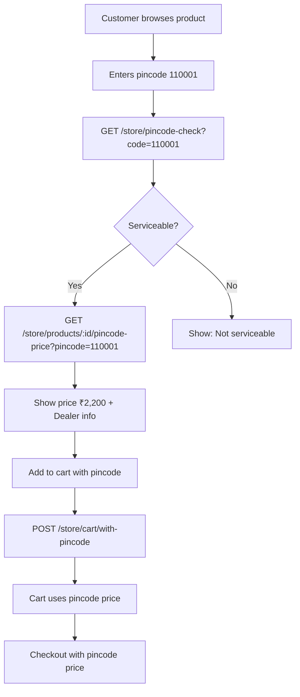

# 🎯 Pincode-Based Pricing System - Complete Implementation

## Overview

This system transforms your Medusa store from **currency-based pricing** to **pincode-based pricing** as the primary pricing mechanism. Prices are determined by the customer's pincode and the dealer serving that area.

---

## 🏗️ Architecture

### Database Tables

1. **`price` table** (Medusa standard)

   - Purpose: Compatibility with Medusa's pricing system
   - Usage: Admin panel displays, backup pricing
   - Structure: Links to `price_set`, currency-based

2. **`product_pincode_price` table** (Custom)

   - Purpose: **PRIMARY PRICING SOURCE**
   - Usage: Customer-facing pricing, cart, checkout
   - Structure: `product_id`, `pincode`, `dealer_id`, `price`
   - Cascade Delete: Automatically deleted when product is deleted

3. **`dealer` table** (Custom)

   - Purpose: Store dealer information
   - Fields: `id`, `code`, `name`, `is_active`

4. **`pincode_dealer` table** (Custom)
   - Purpose: Map pincodes to dealers
   - Fields: `pincode`, `dealer_id`, `delivery_days`, `is_cod_available`, `is_serviceable`

---

## 📁 File Structure

```
src/
├── admin/
│   └── widgets/
│       └── product-pincode-pricing.tsx          # Product detail page widget
├── api/
│   ├── admin/
│   │   └── pincode-pricing/
│   │       ├── prices/
│   │       │   ├── route.ts                     # GET prices
│   │       │   └── [id]/route.ts                # PUT update price
│   │       ├── sync-product/
│   │       │   └── [product_id]/route.ts        # POST sync currency → pincode
│   │       ├── template/route.ts                # GET CSV template
│   │       └── upload/route.ts                  # POST CSV upload
│   ├── store/
│   │   ├── pincode-check/route.ts               # GET check pincode serviceability
│   │   ├── products/
│   │   │   └── [product_id]/
│   │   │       └── pincode-price/route.ts       # GET product pincode price
│   │   └── cart/
│   │       └── with-pincode/route.ts            # POST add to cart with pincode
│   └── middlewares/
│       └── pincode-context.ts                   # Capture customer pincode
├── modules/
│   └── pincode-pricing/
│       ├── models/
│       │   ├── dealer.ts
│       │   ├── pincode-dealer.ts
│       │   └── product-pincode-price.ts
│       ├── service.ts                           # Pincode pricing service
│       └── migrations/
│           └── *.ts                             # Database migrations
├── workflows/
│   ├── calculate-cart-pincode-pricing.ts        # Cart calculation workflow
│   └── product-deleted.ts                       # Cleanup on product deletion
└── subscribers/
    └── price-sync.ts                            # Auto-sync currency → pincode
```

---

## 🔄 How It Works

### 1. Product Creation



### 2. Customer Flow



### 3. Cart & Checkout

- **Pincode is captured from**:

  1. HTTP Header: `X-Customer-Pincode: 110001`
  2. Query param: `?pincode=110001`
  3. Cart metadata: `cart.metadata.customer_pincode`

- **Cart creation**:

  ```bash
  POST /store/cart/with-pincode
  Body: {
    "product_id": "prod_xxx",
    "pincode": "110001",
    "quantity": 1
  }
  ```

- **Pricing priority**:
  1. **Primary**: `product_pincode_price.price` (pincode-based)
  2. **Fallback**: `price.amount` (currency-based)

---

## 🎨 Admin Features

### Product Detail Page Widget

Located at the bottom of each product detail page:

**Features**:

- ✅ View all pincode prices for the product
- ✅ See which dealer serves each pincode
- ✅ Edit prices inline (click on price to edit)
- ✅ Activate/deactivate prices
- ✅ Sync from currency price (one click)
- ✅ Link to CSV upload page
- ✅ Statistics: Total pincodes, avg price, etc.

**Widget appears when**:

- User is on `/app/products/:product_id` page
- Automatically refreshes on changes

### CSV Management

**Location**: `/app/pincode-pricing`

**Features**:

- Download template with current products
- Pre-filled with existing prices
- Bulk upload via CSV/Excel
- Column format: `SKU | Product Name | 110001 | 110002 | ...`

---

## 🔧 API Reference

### Store APIs (Customer-Facing)

#### 1. Check Pincode Serviceability

```bash
GET /store/pincode-check?code=110001

Response:
{
  "serviceable": true,
  "dealers": [...],
  "delivery_days": 2,
  "is_cod_available": true
}
```

#### 2. Get Product Pincode Price

```bash
GET /store/products/prod_xxx/pincode-price?pincode=110001

Response:
{
  "product_id": "prod_xxx",
  "pincode": "110001",
  "price": 2200.00,
  "price_formatted": "₹2,200.00",
  "currency": "INR",
  "dealer": "Delhi Dealer",
  "delivery_days": 2,
  "is_cod_available": true
}
```

#### 3. Add to Cart with Pincode

```bash
POST /store/cart/with-pincode
Body: {
  "product_id": "prod_xxx",
  "pincode": "110001",
  "quantity": 1
}

Response:
{
  "cart": {
    "id": "cart_xxx",
    "items": [...],
    "subtotal": 2200.00,
    "total": 2200.00
  },
  "pincode_info": {
    "pincode": "110001",
    "dealer": "Delhi Dealer",
    "delivery_days": 2,
    "is_cod_available": true
  }
}
```

### Admin APIs

#### 1. Get Product Prices

```bash
GET /admin/pincode-pricing/prices?product_id=prod_xxx

Response:
{
  "prices": [...],
  "count": 150
}
```

#### 2. Update Price

```bash
PUT /admin/pincode-pricing/prices/price_xxx
Body: {
  "price": 2500.00,
  "is_active": true
}
```

#### 3. Sync Product Prices

```bash
POST /admin/pincode-pricing/sync-product/prod_xxx

Response:
{
  "success": true,
  "created": 50,
  "updated": 100,
  "pincodes_covered": 150
}
```

---

## 💾 Data Flow

### Adding Price via Admin Panel

```
1. Admin sets INR price: ₹2,200
   ↓
2. Stored in `price` table: amount = 2200
   ↓
3. price-sync subscriber detects change
   ↓
4. Gets all dealers and pincodes
   ↓
5. Creates entries in `product_pincode_price`:
   - prod_xxx | 110001 | dealer_1 | 2200.00
   - prod_xxx | 110002 | dealer_1 | 2200.00
   - prod_xxx | 110001 | dealer_2 | 2200.00
   ...
```

### Customer Add to Cart

```
1. Customer enters pincode: 110001
   ↓
2. Frontend: GET /store/products/prod_xxx/pincode-price?pincode=110001
   ↓
3. Backend queries: SELECT * FROM product_pincode_price
                     WHERE product_id = 'prod_xxx'
                     AND pincode = '110001'
   ↓
4. Returns best price (lowest from available dealers)
   ↓
5. Customer adds to cart
   ↓
6. POST /store/cart/with-pincode
   ↓
7. Cart created with:
   - item.unit_price = pincode price (2200.00)
   - item.metadata.pincode = "110001"
   - cart.metadata.customer_pincode = "110001"
   ↓
8. Checkout uses pincode price
```

---

## ✅ Validations & Checks

### Pincode Format

- **Must be**: Exactly 6 digits
- **Examples**: `110001`, `400001`
- **Invalid**: `110001 `, `11001`, `ABCDEF`

### Price Updates

- Must be positive number
- Stored as decimal (not integer)
- Display with 2 decimal places

### Serviceability

- Checks `pincode_dealer` table
- `is_serviceable = true`
- `is_active = true` for dealer

---

## 🗑️ Product Deletion

**Automatic Cleanup** via CASCADE delete:

```sql
-- When you delete a product
DELETE FROM product WHERE id = 'prod_xxx';

-- This automatically triggers
DELETE FROM product_pincode_price WHERE product_id = 'prod_xxx';
```

**Foreign Key Constraint**:

```sql
ALTER TABLE product_pincode_price
ADD CONSTRAINT product_pincode_price_product_id_foreign
FOREIGN KEY (product_id)
REFERENCES product(id)
ON DELETE CASCADE;
```

---

## 💰 Tax Calculation

Pincode prices work seamlessly with Medusa's tax system:

1. **Tax Region**: Based on pincode mapping
2. **Tax Rate**: Applied to pincode price
3. **Final Price**: `pincode_price + (pincode_price * tax_rate)`

**Example**:

```
Pincode Price: ₹2,200
Tax Rate (GST): 18%
Tax Amount: ₹396
Final Price: ₹2,596
```

---

## 📊 CSV Format

### Download Template

```csv
SKU,Product Name,110001,110002,400001,400002
TSHIRT-001,Red T-Shirt,999,999,1099,1099
TSHIRT-002,Blue T-Shirt,899,899,999,999
```

### Upload Format

- **Row 1**: Headers (SKU, Product Name, ...pincodes)
- **Row 2+**: Data
- **Empty cells**: Skip that product-pincode combination
- **Price format**: Just the number (e.g., `2200` or `2200.00`)

---

## 🎯 Priority System

When multiple dealers serve the same pincode:

1. **Lowest price wins**
2. If prices are equal → **Highest priority dealer** (priority field)
3. If priority is equal → **First dealer**

```typescript
// Service logic
prices.sort((a, b) => {
  // Sort by price first
  if (a.price !== b.price) {
    return Number(a.price) - Number(b.price);
  }
  // Then by dealer priority
  return a.dealer.priority - b.dealer.priority;
});

return prices[0]; // Best option
```

---

## 🚀 Quick Start

### 1. Setup Dealers

```bash
# Via admin panel or API
POST /admin/pincode-pricing/dealers
Body: {
  "code": "DEALER_DELHI",
  "name": "Delhi Central Dealer",
  "is_active": true
}
```

### 2. Map Pincodes

```bash
POST /admin/pincode-pricing/pincode-dealers
Body: {
  "pincode": "110001",
  "dealer_id": "dealer_xxx",
  "delivery_days": 2,
  "is_cod_available": true,
  "is_serviceable": true
}
```

### 3. Add Product with Price

- Create product in admin
- Set INR price: ₹2,200
- Auto-sync creates pincode prices

### 4. Test Customer Flow

```bash
# Check pincode
curl "http://localhost:9000/store/pincode-check?code=110001"

# Get price
curl "http://localhost:9000/store/products/prod_xxx/pincode-price?pincode=110001"

# Add to cart
curl -X POST "http://localhost:9000/store/cart/with-pincode" \
  -H "Content-Type: application/json" \
  -d '{"product_id":"prod_xxx","pincode":"110001","quantity":1}'
```

---

## 📝 Best Practices

1. **Always capture pincode early**: Get pincode before showing prices
2. **Use CSV for bulk**: For 100+ products, use CSV upload
3. **Sync after price changes**: Click "Sync from Currency Price" after updating admin prices
4. **Monitor dealer coverage**: Ensure all pincodes have at least one dealer
5. **Test edge cases**: Empty pincodes, unavailable products, etc.

---

## 🐛 Troubleshooting

### Price not showing?

1. Check if pincode is serviceable
2. Verify `product_pincode_price` has entry for product + pincode
3. Check dealer is active
4. Run sync: `POST /admin/pincode-pricing/sync-product/:product_id`

### Cart showing wrong price?

1. Verify pincode is in cart metadata
2. Check `item.metadata.pincode_price` is set
3. Ensure middleware is capturing pincode

### CSV upload fails?

1. Check pincode format (6 digits)
2. Verify SKU matches product
3. Ensure dealers exist and are active

---

## 🎉 Summary

You now have a complete pincode-based pricing system where:

✅ **Products** can have different prices for different pincodes  
✅ **Customers** see prices based on their location  
✅ **Cart & Checkout** use pincode-based pricing  
✅ **Admin** can manage prices via UI widget or CSV  
✅ **Tax** calculations work seamlessly  
✅ **Cleanup** happens automatically on product deletion  
✅ **CSV** support for bulk operations

**Your system is production-ready! 🚀**
